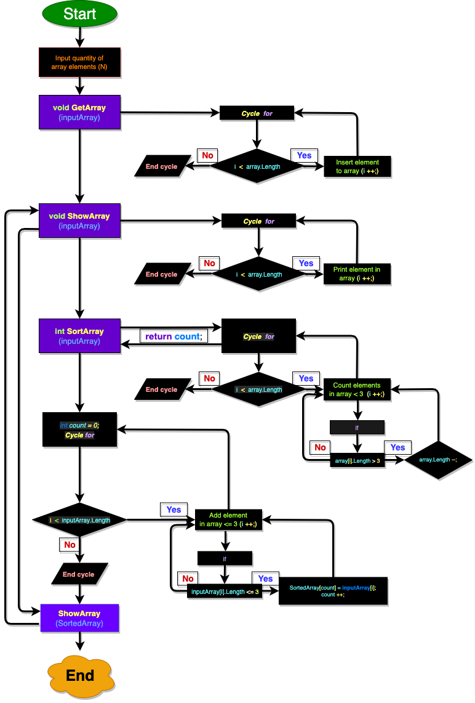

# Задание
Написать программу, которая из имеющегося массива строк формирует массив из строк, длинна которых меньше или равна 3 символам.

Первоначальный массив будет вводиться с клавиатуры отдельным методом.
```
```
## 1. Блок-схема


## 2. Ссылка на диаграмму на [draw.io.](https://app.diagrams.net/#HTimurRM%2FBootCamp_Pro_4_Selection_Sort%2Fmain%2FDiagram.drawio)
```
```
 ## 3. Описание решения
```

 ### Создаем три метода:

 #### 1. Метод ввода элементов массива с консоли;
 #### 2. Метод вывода элементов массива в консоль;
 #### 3. Метод отсортировки строк в массиве длинной более 3 символов

 #### 4. Основной код программы, добавляющий в новый массив элементы длинной больше либа равных 3.

```


